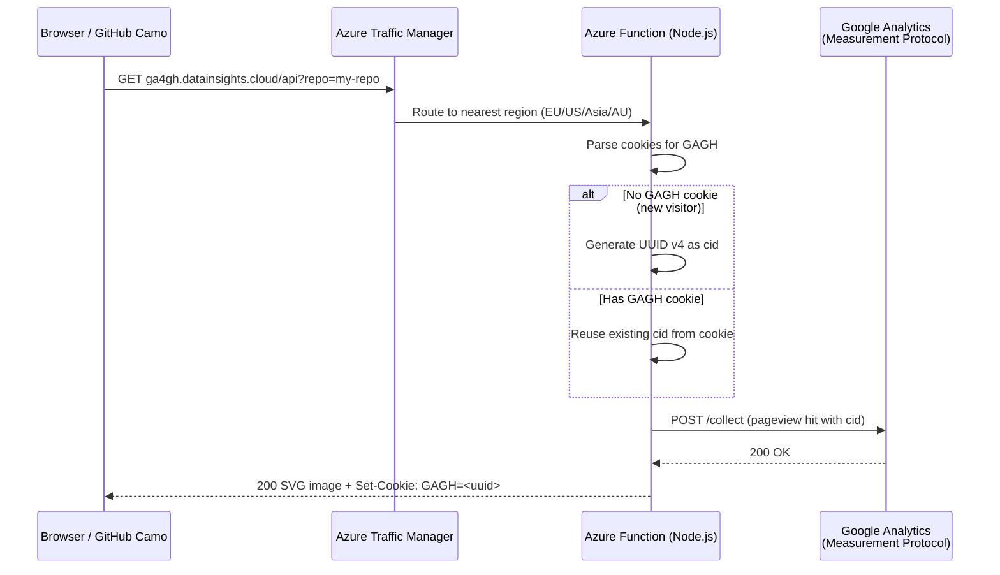

# PRD: Google Analytics Tracking Beacon for GitHub

> **Status:** Modernized — GA4 migration complete, deployed and functional across 4 Azure regions
> **Author:** Sascha Dittmann (fork of [dgkanatsios/gaforgithub](https://github.com/dgkanatsios/gaforgithub))
> **License:** MIT
> **Date:** 2026-04-20

### Current Status

The project is **deployed and functional** across 4 Azure regions using **GA4 Measurement Protocol**, **Azure Functions v4**, and **Node.js 20**. All legacy dependencies (`axios`, `retry`, `dotenv`) have been replaced with zero-dependency alternatives using Node.js 20 built-in APIs.

> ⚠️ **Node.js 20 reaches end-of-life on April 30, 2026.** Upgrade to Node.js 24 is planned as the next effort.

---

## 1. Introduction

**gaforgithub** is a lightweight, self-hosted tracking beacon that enables Google Analytics pageview tracking for GitHub repositories. It works by embedding an invisible (or badge-style) image URL into any Markdown file (README, wiki, etc.). When a browser or GitHub's image proxy renders the Markdown, it fetches the image from an Azure Function, which records a pageview hit to the Google Analytics Measurement Protocol before returning an SVG response.

### Problem It Solves

GitHub's built-in traffic analytics:

- Only retain data for the **last 14 days**.
- Provide **no real-time** pageview information.
- Are limited to repository owners and collaborators.

This project fills that gap by proxying pageview events into Google Analytics, giving repository owners unlimited historical data, real-time dashboards, and the full GA reporting suite.

### Inspiration

Inspired by [igrigorik/ga-beacon](https://github.com/igrigorik/ga-beacon), which solves the same problem using Go on Google App Engine. This project reimplements the concept using **Node.js** on **Azure Functions**.

---

## 2. Goals

- **Unlimited historical tracking** — Persist GitHub repository pageview data beyond GitHub's 14-day window by forwarding events to Google Analytics.
- **Zero-friction integration** — Repository owners embed a single Markdown image tag; no JavaScript, no build steps, no client-side code.
- **Minimal cost** — Run on Azure Functions Consumption Plan to keep hosting costs near zero for low-to-moderate traffic.
- **Privacy-aware** — Support IP anonymization (via `ANONYMIZE_IP` setting) and respect GitHub's Camo image proxy constraints.
- **Global low-latency** — Multi-region deployment across 4 Azure regions (Europe, US, Asia, Australia) with Azure Traffic Manager performance-based routing.
- **One-click deployment** — Provide an ARM template ("Deploy to Azure" button) so users can stand up their own instance without CLI knowledge.
- **Infrastructure-as-Code** — Provide Terraform templates for multi-region deployment with Traffic Manager, custom hostnames, and SSL certificates.

---

## 3. User Stories

| # | Story |
|---|-------|
| 1 | As a **repository owner**, I want to embed a tracking pixel in my README so that I can see pageview counts in Google Analytics with no time-window limitation. |
| 2 | As a **repository owner**, I want to optionally display a visible "GA \| GH" badge so visitors know analytics are active (and so I have a visual indicator the integration works). |
| 3 | As a **repository owner**, I want to embed an invisible 1×1 SVG instead of a badge so tracking is silent. |
| 4 | As a **repository owner**, I want unique visitors to be tracked via cookies so that repeated visits from the same user within a session are deduplicated. |
| 5 | As a **new user**, I want to deploy the entire solution to my Azure subscription with a single button click so I don't need to use the Azure CLI or portal manually. |
| 6 | As a **developer**, I want to run the function locally for debugging so I can iterate quickly. |

---

## 4. Functional Requirements

### 4.1 HTTP Endpoint (Azure Function)

1. The system **must** expose a single HTTP-triggered Azure Function at the path `/api` (configurable via `host.json` route prefix).
2. The function **must** accept anonymous requests (no API key or auth token required) — configured via `"authLevel": "anonymous"` in `function.json`.
3. The function **must** accept a query parameter `repo` (e.g., `?repo=my-project`) that identifies the page being tracked. If `repo` is missing, the function **must** return HTTP `400` with a descriptive error message.
4. The function uses a catch-all route `{*segments}` to handle any sub-path under `/api`.

### 4.2 Google Analytics Integration

5. The system **must** send a `page_view` event to the [GA4 Measurement Protocol](https://developers.google.com/analytics/devguides/collection/protocol/ga4) (`https://www.google-analytics.com/mp/collect`).
6. The endpoint URL **must** include `measurement_id` and `api_secret` as query parameters. The JSON payload **must** include:
   - `client_id`: An anonymous client ID (UUID v4) — generated for new visitors or reused from the `GAGH` cookie
   - `events[]`: Array containing a single `page_view` event with params:
     - `page_location`: `/<repo>` (the `repo` query parameter prefixed with `/`)
     - `page_referrer`: From the `Referer` request header (only if present)
     - `user_agent`: From the `User-Agent` request header (only if present)
     - `ip_override`: Client IP from `X-Forwarded-For` (omitted when `ANONYMIZE_IP=1`)
     - `engagement_time_msec`: Set to `"1"` for proper GA4 session attribution
7. The GA request **must** use Node.js native `fetch` with a custom exponential backoff retry wrapper (max **5 attempts**, min **1 second**, max **60 second** timeout, retry on network errors or 5xx status codes).

### 4.3 Cookie-Based Client ID Management

8. The system **must** check for a cookie named `GAGH` in the incoming request.
9. If the `GAGH` cookie **exists**, the system **must** reuse its value as the `cid` (client ID) for the GA hit. The GA tracking call is **still sent** on every request — the cookie is used for client identity continuity, not deduplication.
10. If the `GAGH` cookie **does not exist**, the system **must** generate a new UUID v4 as the anonymous client ID, set the `GAGH` cookie in the response, and send the GA hit.

### 4.4 SVG Response

11. The system **must** return an SVG image with `Content-Type: image/svg+xml`.
12. If the query string contains the `empty` parameter (e.g., `?repo=foo&empty`), the system **must** return a **1×1 transparent SVG** (`empty.svg`) — used for invisible tracking.
13. If the `empty` parameter is absent, the system **must** return the **"GA | GH" green badge SVG** (`gag-green.svg`) — a shields.io-style badge.
14. The response **must** include `Cache-Control: private, no-store` to prevent caching by intermediaries and ensure each request triggers the function.

### 4.5 Configuration

| Environment Variable | Required | Description |
|---|---|---|
| `GA_MEASUREMENT_ID` | Yes | GA4 Measurement ID (format: `G-XXXXXXXXXX`) |
| `GA_API_SECRET` | Yes | GA4 Measurement Protocol API secret (generated in GA4 Admin → Data Streams) |
| `ANONYMIZE_IP` | No | Set to `1` to exclude client IP from the GA4 payload entirely. GA4 handles IP anonymization by default. |
| `APPINSIGHTS_INSTRUMENTATIONKEY` | No | Azure Application Insights key for function-level monitoring |
| `AzureWebJobsStorage` | Yes (Azure) | Azure Storage connection string for the Functions runtime |

### 4.6 Infrastructure & Deployment

#### ARM Template (`azuredeploy.json`)

15. The system **must** include an ARM template that provisions:
    - An **Azure Functions App** (Consumption Plan / Dynamic SKU)
    - A **Storage Account** (default `Standard_LRS`)
    - An **Application Insights** instance (in the same region as the resource group)
    - **Source control integration** pointing to `https://github.com/SaschaDittmann/gaforgithub` (master branch)
16. The ARM template **must** configure:
    - Azure Functions runtime v3 (`FUNCTIONS_EXTENSION_VERSION: ~3`)
    - Node.js 14 (`WEBSITE_NODE_DEFAULT_VERSION: ~14`)
    - The `PROPERTY_ID` app setting from the user-supplied `gaTrackingID` parameter
    - The `Project` app setting pointing to `functions` (so Azure deploys only the `functions/` subdirectory)
17. The system **must** include an `azuredeploy.parameters.json` file with placeholder values (`GEN-UNIQUE`) for Azure Quickstart template validation.

#### Terraform Multi-Region Deployment (`terraform/`)

18. The system **must** include Terraform templates that provision a **multi-region deployment** across 4 Azure regions:
    - **West Europe** (`westeurope`)
    - **Central US** (`centralus`)
    - **Southeast Asia** (`southeastasia`)
    - **Australia Southeast** (`australiasoutheast`)
19. Each region **must** have its own Azure Functions App, Storage Account, App Insights instance, and App Service Plan, provisioned via a reusable Terraform module (`modules/func`).
20. An **Azure Traffic Manager** profile **must** route traffic using the `Performance` routing method, directing users to the nearest region.
21. Each function app **must** support a **custom hostname** with an SSL/TLS certificate.
22. The Terraform configuration requires the `azurerm` provider (>= 2.55).

#### GitHub Actions CI/CD (`.github/workflows/master.yml`)

23. The system **must** include a GitHub Actions workflow that triggers on push to `master` (and manual `workflow_dispatch`).
24. The workflow **must** build the project (Node.js 14, `npm install` in `functions/`) and deploy to **all 4 regions** (Europe, US, Asia, Australia) using `Azure/functions-action@v1` with per-region publish profiles stored as GitHub Secrets.

### 4.7 Local Development

18. The system **must** include a `debug.sh` script that:
    - Ensures Node.js v14 is available (falls back to `/usr/local/opt/node@14/bin`)
    - Runs `npm install` and `npm run build/test` in the `functions/` directory
    - Starts the Azure Functions Core Tools local runtime (`func start`)
19. Local settings **must** be configurable via `functions/local.settings.json` (git-ignored).

---

## 5. Non-Goals (Out of Scope)

- **Dashboard / UI** — This project does not include any frontend dashboard. All reporting is done within the Google Analytics web interface.
- **User authentication or authorization** — The endpoint is intentionally anonymous and public.
- **Rate limiting / abuse prevention** — Not currently implemented; the Consumption Plan's concurrency settings provide basic throttling.
- **Multi-function support** — The project contains a single function (`gaforgithub`); it is not designed as a multi-endpoint API.

---

## 6. Design Considerations

### Visual Assets

| Asset | Dimensions | Purpose |
|---|---|---|
| `gag-green.svg` | 54×20 px | Shields.io-style badge displaying "GA \| GH" in grey/green. Used as the default visible tracking beacon. |
| `empty.svg` | 1×1 px | Transparent pixel SVG. Used when the `&empty` query parameter is present for invisible tracking. |

### User-Facing Integration

The production instance uses a custom domain: `ga4gh.datainsights.cloud`.

Users embed one of two Markdown snippets in their README (or any Markdown file):

**Visible badge:**
```markdown
[](https://github.com/SaschaDittmann/gaforgithub)
```

**Invisible pixel:**
```markdown

```

---

## 7. Technical Considerations

### Architecture



### Runtime & Dependencies

| Component | Version / Detail |
|---|---|
| Azure Functions Runtime | v4 (`~4`) |
| Node.js | 20 (`~20`) — **EOL April 30, 2026; Node 24 upgrade planned** |
| `@azure/functions` | ^4.x — Azure Functions v4 programming model |
| Native `fetch` | Built-in Node.js 20 — replaces `axios` |
| Custom retry wrapper | `retry.js` — replaces `retry` npm package |

### Observability

The function implements **structured logging** using Azure Functions context logging levels:
- `context.log()` — General info (request received, form data, retry attempts)
- `context.log.verbose()` — Debug details (cookie state, CID, response codes)
- `context.log.warn()` — Missing parameters (e.g., no `repo` in query string)
- `context.log.error()` — Failed GA requests with error details

**Application Insights** is configured with sampling enabled (excluding `Request` telemetry) via `host.json`.

### Known Limitations

1. **GitHub Camo Proxy** — GitHub proxies all images through its [Camo service](https://docs.github.com/en/authentication/keeping-your-account-and-data-secure/about-anonymized-image-urls), which:
   - Strips the original user's IP address, referrer, and user agent.
   - Aggressively caches images, so the same visitor may not trigger a new request.
   - This means GA data from GitHub-rendered Markdown will show Camo's IP/UA, not the real visitor's.
2. **Cookie ineffectiveness on GitHub** — Because images are fetched server-side by Camo (not by the user's browser), cookies are not persisted between pageviews. The `GAGH` cookie client ID continuity only works when the beacon URL is loaded directly in a browser.

### Technical Debt & Modernization Opportunities

| Area | Current State | Improvement |
|---|---|---|
| ~~**GA Version**~~ | ~~Universal Analytics~~ | ✅ Migrated to GA4 Measurement Protocol |
| ~~**Node.js Version**~~ | ~~14 — EOL~~ | ✅ Upgraded to Node.js 20 |
| ~~**Azure Functions Runtime**~~ | ~~v3~~ | ✅ Upgraded to v4 |
| ~~**HTTP Client**~~ | ~~`axios ^0.21.1`~~ | ✅ Replaced with native `fetch` |
| ~~**Retry Library**~~ | ~~`retry ^0.12.0`~~ | ✅ Replaced with custom retry wrapper |
| ~~**Tests**~~ | ~~None~~ | ✅ 50 tests (14 suites) using `node:test` |
| ~~**CI/CD Workflow**~~ | ~~Node 14, outdated actions~~ | ✅ Node 20, Ubuntu, v4 actions, test+deploy pipeline |
| ~~**ARM Template**~~ | ~~Legacy API versions~~ | ✅ Upgraded to 2023-01-01 API versions, Functions v4 |
| ~~**Terraform**~~ | ~~`azurerm >= 2.55`~~ | ✅ Upgraded to `>= 4.0`, new resource types |
| **Node.js 24** | Node.js 20 EOL is April 30, 2026 | Upgrade to Node.js 24 LTS (runtime, CI, Terraform, ARM) |

---

## 8. Success Metrics

| Metric | How to Measure |
|---|---|
| **Pageviews recorded** | GA dashboard shows pageview events corresponding to `repo` values. |
| **Deployment success** | "Deploy to Azure" button provisions all resources without errors. |
| **Response latency** | Azure Function responds with the SVG in < 500ms (p95), measured via Application Insights. |
| **Retry effectiveness** | Failed GA Measurement Protocol calls are retried up to 5 times without user impact. |
| **Cost** | Monthly Azure bill stays within Consumption Plan free grant for typical open-source project traffic volumes. |

---

## 9. Resolved Questions

| # | Question | Resolution |
|---|---|---|
| 1 | Is this project still actively used? | **Yes.** Still deployed to Azure (4 regions) but non-functional due to UA sunset. |
| 2 | Should modernization be prioritized? | **Yes.** GA4 migration, Node.js upgrade, and Functions v4 are planned. This PRD documents the status quo first. |
| 3 | Is `ANONYMIZE_IP` a bug? | **No longer a bug.** The master branch already wires `process.env.ANONYMIZE_IP` into the GA `aip` parameter. (Initial reverse-engineering was based on the older development branch.) |
| 4 | Fork divergence strategy? | **Fully independent.** This fork will not contribute changes back to `dgkanatsios/gaforgithub`. |
| 5 | GA4 property setup? | **Already exists.** A GA4 property and Measurement ID are available and ready to use. |
| 6 | Modernization scope? | **Single big-bang effort.** GA4 migration, Node.js 20, Azure Functions v4, tests, CI/CD, and bug fixes will all ship together. |

## 10. Open Questions

| # | Question | Notes |
|---|---|---|
| 1 | Should the Node.js 24 upgrade be a separate branch or direct commit to development? | Node 20 EOL is April 30, 2026 — 10 days away. Suggest a fast-track branch. |
| 2 | Should the old `PROPERTY_ID` app setting be removed from Azure? | It's still present but unused. Cleanup is safe. |
